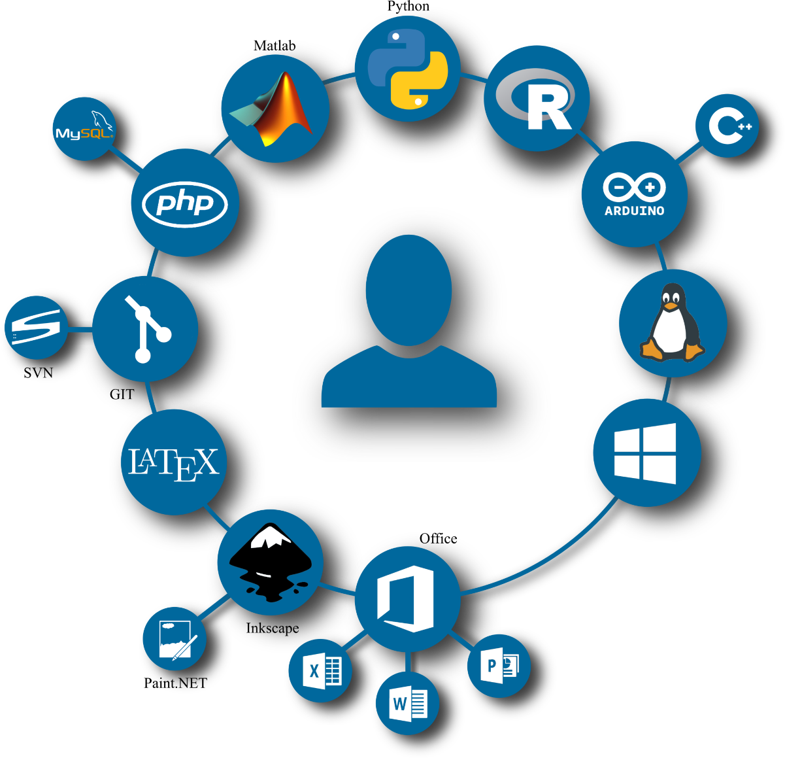
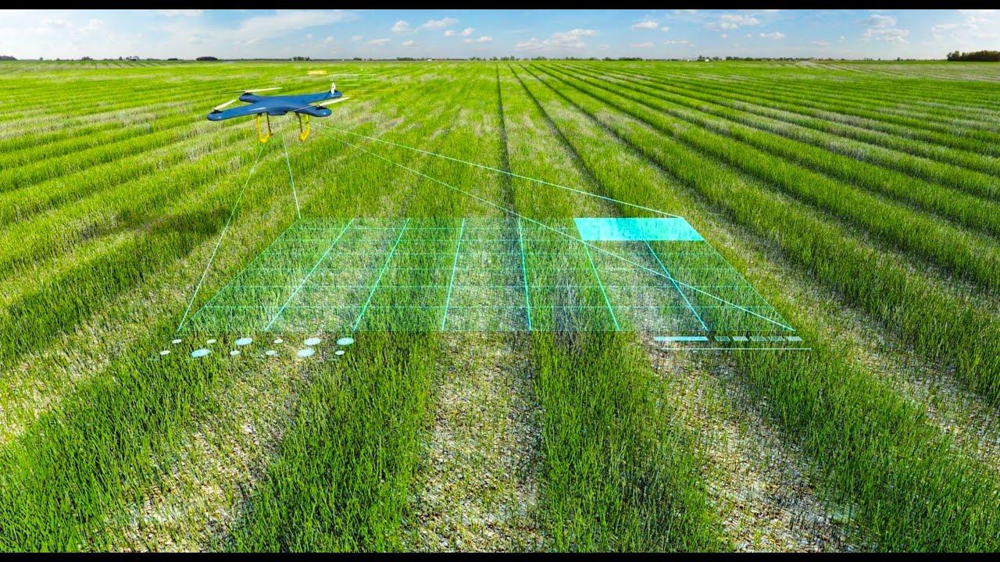

# Data Science Portfolio
### This repo contains my projects in data science (skill based, end to end, ...), and also some courses or certificates i took

-------

## End to End Projects
---------

  <h3><a href="https://github.com/MuhamedGad/SkillPilot--End2End-Project">Skill Pilot</a></h3>

  

**Description** : 

An end-to-end data science project that assists individuals in making informed decisions about their next steps in the software engineering industry.

**Data**: 

The project uses the [Stackoverflow Yearly Suervey](https://survey.stackoverflow.co/)

**Skills & Tools**:

* Data Preprocessing & Cleaning
* Exploratory Data Analysis (EDA)
* Feature Engineering
* Model Deployment
* MLflow
* Visualization ( mainly sued plotly and dash)

**Team Members** 
Only me

  
More Details : [Click Here](https://github.com/MuhamedGad/SkillPilot--End2End-Project)

-----------------

  <h3><a href="https://github.com/MuhamedGad/Farm-Vision">Farm Vision</a></h3>

  

**Description** : 

Our graduation project is a helpful platform for farmers, making it easy for them to manage everything related to their land. Additionally, it aids in production by using computer vision to detect diseases, harmful insects, and provides a quick overview of the quantity of fruits.

**Data**: 

The project uses datasets from different resources such as Kaggle and Roboflow

**Skills & Tools**:

* Image preprocessing
* Transfer Learning
* Object detecting
* Object Tracking
* Error Analysis
* yolov7

**Team Members** 

Team of 5 members: 

One for the front-end (Web) 

One for the back-end 

One for the flutter (App) 

two for the AI 

  More Details : [Click Here](https://github.com/MuhamedGad/Farm-Vision)

  -----------------

  <h3><a href="https://github.com/MuhamedGad/Face-Lock-Extenstion">Face Lock</a></h3>

  

**Description** : 

TabLock is a Chrome extension that protects your privacy by using face recognition as an extra layer of security for any domain you add. It keeps your sensitive data safe if you have shared your PC with someone or if there are some intrusive people in your life.

**Data**: 

The project takes the data from the user. Typically a 30 Secs Video

**Skills & Tools**:

* Image Processing
* GAN
* VGG16
* MTCNN
  

**Team Members** 

Team of 3 members: 

One for the front-end 
One for the back-end 
One for the AI part

  More Details : [Click Here](https://github.com/MuhamedGad/Face-Lock-Extenstion/tree/main)

